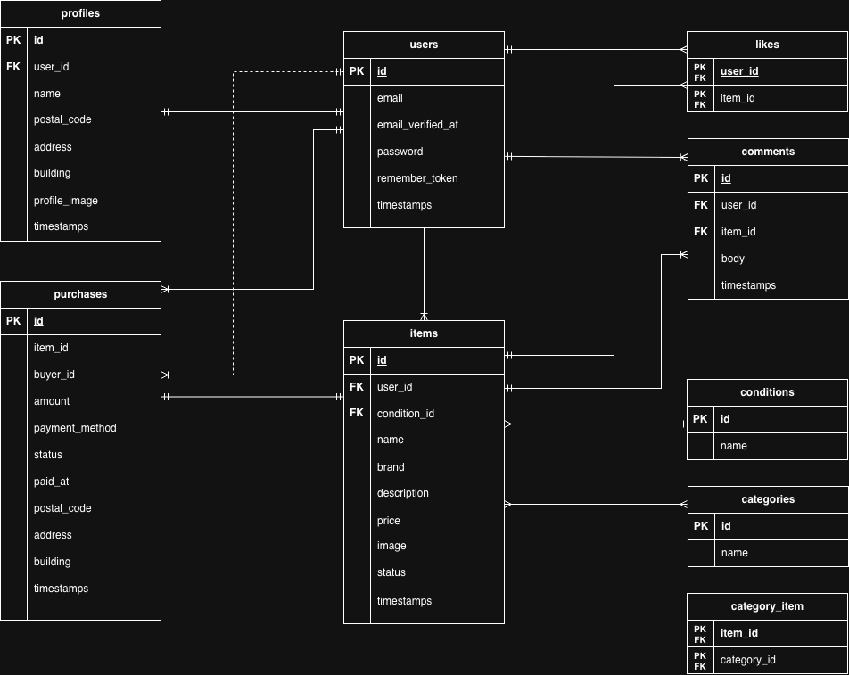

# フリマアプリ

## 環境構築

1. リポジトリをクローン
```bash
git clone https://github.com/aliettamediter/flea-market_app.git
cd flea-market_app
```

2. 環境変数の設定
```bash
cp src/.env.example src/.env
```

3. Dockerコンテナの起動
```bash
docker-compose up -d
```

※ 以下のコマンドは `docker-compose exec php bash` でコンテナに入った後に実行してください。

4. パッケージのインストール
```
composer install
```

5. アプリケーションキーの生成
```
php artisan key:generate
```

6. マイグレーションとシーダーの実行
```
php artisan migrate --seed
```

7. ストレージのシンボリックリンク作成
```
php artisan storage:link
```

8. Stripeの設定
`.env` に以下を追加してください：
```
STRIPE_KEY=your_stripe_public_key
STRIPE_SECRET=your_stripe_secret_key
```

## テスト実行

※ 以下のコマンドは `docker-compose exec php bash` でコンテナに入った後に実行してください。

テスト用データベースを事前に作成してください（phpMyAdminまたはMySQLで `demo_test` を作成）

テストを実行：

```
php artisan test
```

## 機能一覧

- 会員登録・メール認証
- ログイン・ログアウト
- プロフィール設定
- 商品出品・一覧・詳細
- 商品検索
- いいね機能
- コメント機能
- 購入・決済（Stripe）

## 使用技術

| 技術 | バージョン |
|------|-----------|
| PHP | 8.1 |
| Laravel | 8.83 |
| MySQL | 8.0 |
| Nginx | 1.21 |
| Docker | - |
| Stripe | - |

## テーブル設計

| テーブル | 説明 |
|---------|------|
| users | ユーザー情報 |
| profiles | プロフィール情報 |
| items | 商品情報 |
| conditions | 商品の状態 |
| categories | カテゴリ |
| category_item | 商品とカテゴリの中間テーブル |
| likes | いいね |
| comments | コメント |
| purchases | 購入履歴 |

## ER図



## URL

| URL | 説明 |
|-----|------|
| http://localhost | トップページ |
| http://localhost/register | 会員登録 |
| http://localhost/login | ログイン |
| http://localhost/mypage | マイページ |
| http://localhost/sell | 商品出品 |
| http://localhost:8025 | Mailhog |
| http://localhost:8080 | phpMyAdmin |